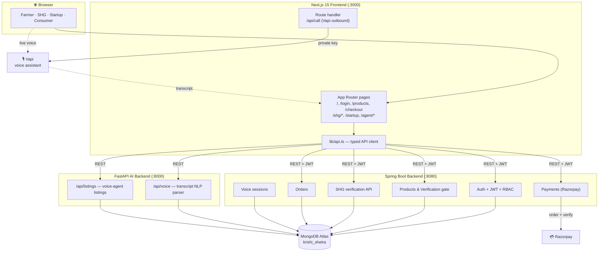
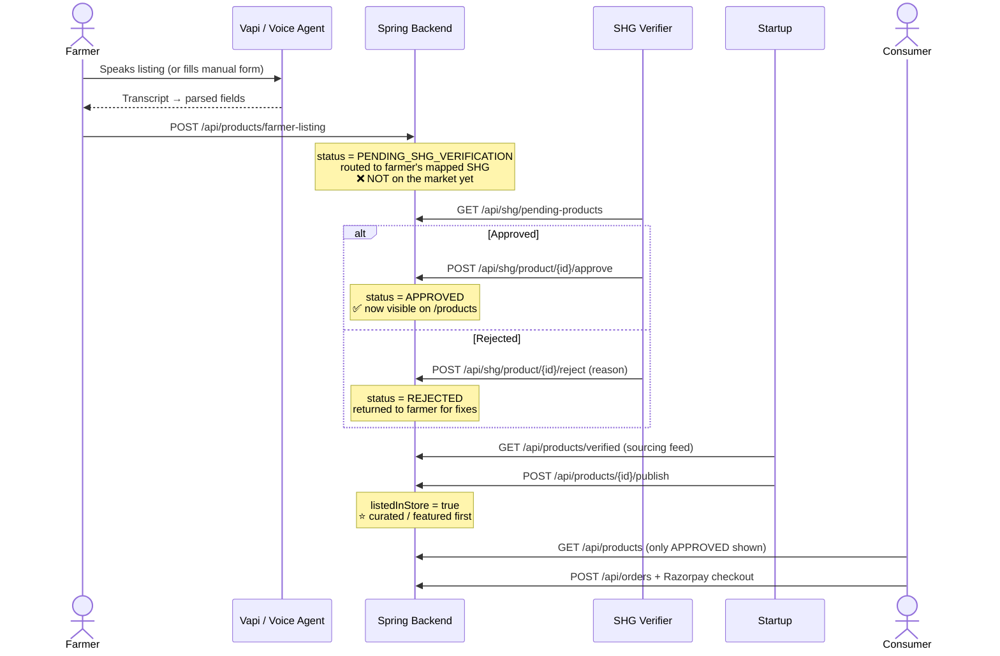

# 🌾 Krishi Shetra

> A voice-first, farm-to-consumer agri-commerce platform that puts an **SHG (Self-Help Group) verification gate** between the farmer's field and the consumer's cart — so every lot on the market is quality-checked before it's sold.

Built for **Smart India Hackathon (SIH)**. Krishi Shetra lets a farmer list produce by simply *speaking* (via an AI voice agent), routes that listing to the Self-Help Group that verifies their community, and only surfaces **SHG-approved** produce to consumers. Startups/FPOs can then curate verified produce into a storefront, and consumers buy it with an integrated Razorpay checkout.

---

## Table of Contents

- [Why Krishi Shetra](#-why-krishi-shetra)
- [Key Features](#-key-features)
- [Architecture](#-architecture)
- [The Verification Pipeline](#-the-verification-pipeline)
- [Tech Stack](#-tech-stack)
- [Repository Structure](#-repository-structure)
- [Roles](#-roles)
- [Getting Started](#-getting-started)
- [Environment Variables](#-environment-variables)
- [Demo Credentials](#-demo-credentials)
- [API Reference](#-api-reference)
- [Security Notes](#-security-notes)

---

## 💡 Why Krishi Shetra

Small and marginal farmers struggle to reach end consumers directly, and buyers have no easy way to trust the quality/authenticity of what they buy. Krishi Shetra solves both:

1. **Zero-friction listing** — A farmer speaks in natural language ("I have twelve quintal of Sharbati wheat, price two thousand four fifty per quintal from Wagholi") and the platform extracts crop, quantity, price and location automatically.
2. **Trust via SHG verification** — Every listing is routed to the farmer's mapped Self-Help Group. Nothing reaches consumers until an SHG **approves** it.
3. **Direct market access** — Approved produce is instantly visible to consumers; startups/FPOs can further curate it into a branded store.
4. **Real payments** — End-to-end checkout with Razorpay (test mode).

---

## ✨ Key Features

| Feature | Description |
|---|---|
| 🎙️ **Voice-first listing** | Farmers list produce by talking. Vapi handles the live voice call in the browser; a FastAPI NLP parser extracts structured fields (crop, quantity, price, location) from the transcript. |
| ✅ **SHG verification workflow** | A dedicated SHG dashboard with pending / approved / rejected queues, per-farmer drill-downs, approve/reject with reasons & remarks, and a full audit trail (`VerificationEvent` history). |
| 🛒 **Consumer marketplace** | Only SHG-approved produce is visible. Curated (startup-listed) items get a badge and sort first. |
| 🏢 **Startup Console** | Startups browse the SHG-verified sourcing feed and "list in store" to feature produce for consumers. |
| 💳 **Razorpay checkout** | Order placement + Razorpay order creation and server-side signature verification. |
| 🔐 **JWT auth + RBAC** | Stateless JWT auth with role-based access control (Farmer, FPO, SHG, Startup, Processor, Consumer). SHG accounts are centrally managed and cannot be self-registered. |
| 📊 **SHG analytics** | Verification trends, most-active farmers/FPOs, top villages. |
| 🌱 **Self-seeding demo** | On a fresh DB the backend seeds an entire SHG → FPO → farmers → listings scenario across every verification state, so the workflow is demonstrable end-to-end. |

---

## 🏗 Architecture

Krishi Shetra is a **polyglot, three-tier system**: a Next.js frontend talking to a Spring Boot core backend and a Python/FastAPI AI backend, backed by a shared MongoDB, with Vapi and Razorpay as external services.



<details>
<summary>ASCII fallback (if Mermaid doesn't render)</summary>

```
                         ┌──────────────────────────────┐
                         │           Browser            │
                         │  Farmer / SHG / Startup /     │
                         │        Consumer              │
                         └───────┬──────────────┬───────┘
                                 │              │ live voice
                                 ▼              ▼
                  ┌─────────────────────┐   ┌──────────┐
                  │  Next.js Frontend   │   │   Vapi   │
                  │       (:3000)       │◄──┤  (voice) │
                  │  lib/api.ts client  │   └──────────┘
                  └───┬─────────────┬───┘
        REST + JWT    │             │   REST
                      ▼             ▼
       ┌─────────────────────┐  ┌────────────────────┐
       │  Spring Boot (:8080)│  │  FastAPI AI (:8000)│
       │  auth · products ·  │  │  voice NLP parser  │
       │  SHG · orders · pay │  │  listings          │
       └──────┬──────────┬───┘  └─────────┬──────────┘
              │          │                │
              │          ▼                │
              │      ┌──────────┐         │
              │      │ Razorpay │         │
              │      └──────────┘         │
              ▼                           ▼
          ┌───────────────────────────────────┐
          │      MongoDB Atlas (krishi_shetra) │
          └───────────────────────────────────┘
```
</details>

---

## 🔁 The Verification Pipeline

The core business rule: **a product is only visible to consumers once an SHG has approved it.** A startup "listing" a product doesn't gate visibility — it only *curates/features* it.



**Verification states:** `PENDING_SHG_VERIFICATION` → `APPROVED` | `REJECTED`. Every transition is recorded as a `VerificationEvent` (actor, role, remark/reason, timestamp) for a full audit trail.

---

## 🧰 Tech Stack

| Layer | Technology |
|---|---|
| **Frontend** | Next.js 15 (App Router, Turbopack), React 19, TypeScript, Tailwind CSS v4, Framer Motion / Motion, Radix UI, lucide-react, OGL |
| **Core Backend** | Java 17, Spring Boot 3.2, Spring Security, Spring Data MongoDB, JWT (jjwt), Lombok, Razorpay Java SDK |
| **AI Backend** | Python, FastAPI, Uvicorn, Motor (async MongoDB), Pydantic v2 |
| **Database** | MongoDB (Atlas) — shared `krishi_shetra` database |
| **Voice** | Vapi (`@vapi-ai/web` browser SDK + outbound-call REST) |
| **Payments** | Razorpay (test mode) |
| **Auth (optional)** | Supabase email-OTP (login screen) |
| **Testing** | JUnit + Spring Boot Test, embedded MongoDB (flapdoodle) for integration tests |

---

## 📁 Repository Structure

```
krishi-shetra/
├── frontend/               # Next.js 15 app (App Router)
│   ├── app/                # Routes
│   │   ├── login/          # Auth
│   │   ├── products/       # Consumer marketplace + product detail
│   │   ├── checkout/       # Razorpay checkout
│   │   ├── agent/          # Voice agent: listings, voice, history
│   │   ├── shg/            # SHG dashboard: pending/approved/rejected, farmers, analytics, verify
│   │   ├── startup/        # Startup Console (sourcing + list in store)
│   │   ├── me/profile/     # User profile
│   │   └── api/call/       # Route handler — Vapi outbound call (server-only key)
│   ├── components/         # UI + shg/* components
│   ├── context/            # Auth, Cart, Shop, Product, Toast contexts
│   ├── hooks/useVapi.ts    # Vapi voice hook
│   └── lib/api.ts          # Typed API client (Spring + FastAPI)
│
├── spring-backend/         # Spring Boot core API
│   └── src/main/java/com/krishishetra/
│       ├── controller/     # Auth, Product, Shg, Order, Payment, VoiceSession
│       ├── service/        # ShgService (verification + routing + analytics)
│       ├── model/          # User, Product, SHG, Order, VoiceSession, VerificationEvent
│       ├── repository/     # Mongo repositories
│       ├── security/       # JwtFilter, JwtUtil, UserDetailsServiceImpl
│       ├── config/         # SecurityConfig, DataSeeder (demo data)
│       └── dto/            # Request/response DTOs
│
└── AIbackend/              # FastAPI AI service
    ├── main.py             # App + CORS + routers
    ├── database.py         # Motor MongoDB client
    ├── models.py           # Pydantic models
    └── routes/
        ├── listings.py     # CRUD for voice-agent listings
        └── voice.py        # Transcript → structured fields NLP parser
```

---

## 👥 Roles

| Role | Can do |
|---|---|
| **Farmer** | List produce (voice or manual), view own listings + verification status/history |
| **FPO** | Farmer Producer Organisation — groups farmers; listings route through their mapped SHG |
| **SHG** | Verify (approve/reject) listings from mapped farmers, view analytics. *Centrally managed — cannot self-register.* |
| **Startup** | Browse the SHG-verified sourcing feed, feature produce in the consumer store (publish/unpublish) |
| **Processor** | Redirected to a separate processor app (`NEXT_PUBLIC_PROCESSOR_URL`) |
| **Consumer** | Browse approved produce, place orders, pay via Razorpay |

---

## 🚀 Getting Started

### Prerequisites

- **Node.js** 18+ and npm
- **Java** 17 + Maven
- **Python** 3.10+
- A **MongoDB** connection string (Atlas or local)
- (Optional) **Vapi**, **Razorpay** and **Supabase** accounts for full functionality

Run the three services in three terminals. Order doesn't strictly matter, but starting the backends first avoids initial fetch errors.

### 1. Spring Boot backend (`:8080`)

```bash
cd spring-backend
# Configure MongoDB + secrets via env vars (see Environment Variables below)
./mvnw spring-boot:run        # Windows: mvnw.cmd spring-boot:run
```

On first run against a fresh DB it seeds a full demo SHG scenario and prints the demo logins.

Run tests:

```bash
./mvnw test         # fast unit tests
./mvnw verify       # + integration tests (embedded MongoDB, no external DB needed)
```

### 2. FastAPI AI backend (`:8000`)

```bash
cd AIbackend
python -m venv .venv && source .venv/Scripts/activate   # Windows Git Bash
pip install -r requirements.txt
cp .env.example .env          # set MONGODB_URI + DB_NAME
uvicorn main:app --reload --port 8000
```

Interactive API docs at http://localhost:8000/docs.

### 3. Next.js frontend (`:3000`)

```bash
cd frontend
npm install
cp .env.example .env.local     # set backend URLs + Vapi/Supabase keys
npm run dev
```

Open http://localhost:3000.

---

## 🔑 Environment Variables

### Frontend (`frontend/.env.local`)

> ⚠️ Every var is `NEXT_PUBLIC_*` and is embedded in the browser bundle — **do not put true secrets here** (the Vapi private key is only used server-side in the `/api/call` route handler).

```bash
NEXT_PUBLIC_BACKEND_URL=http://localhost:8080     # Spring Boot
NEXT_PUBLIC_AI_URL=http://localhost:8000          # FastAPI
NEXT_PUBLIC_PROCESSOR_URL=http://localhost:8081   # Processor app redirect

# Vapi voice assistant
NEXT_PUBLIC_VAPI_PUBLIC_KEY=your-vapi-public-key
NEXT_PUBLIC_VAPI_ASSISTANT_ID=your-vapi-assistant-id
NEXT_PUBLIC_VAPI_PRIVATE_KEY=your-vapi-private-key       # server-only (route handler)
NEXT_PUBLIC_VAPI_PHONE_NUMBER_ID=your-vapi-phone-number-id

# Supabase email-OTP (optional login path)
NEXT_PUBLIC_SUPABASE_URL=your-supabase-url
NEXT_PUBLIC_SUPABASE_ANON_KEY=your-supabase-anon-key
```

### Spring Boot (`spring-backend` — via env vars / `application.properties`)

```bash
SPRING_DATA_MONGODB_URI=mongodb+srv://<user>:<pass>@<cluster>.mongodb.net/krishi_shetra
APP_JWT_SECRET=<a-long-random-secret>
RAZORPAY_KEY_ID=rzp_test_xxxxxxxxxxxxxx
RAZORPAY_KEY_SECRET=your_test_key_secret
# app.cors.allowed-origins defaults to http://localhost:3000,http://localhost:3001
# app.seed.shg-demo=true seeds demo data on a fresh DB (set false to disable)
```

### FastAPI (`AIbackend/.env`)

```bash
MONGODB_URI=mongodb+srv://<user>:<pass>@<cluster>.mongodb.net/?retryWrites=true&w=majority
DB_NAME=krishi_shetra
```

---

## 🧪 Demo Credentials

When `app.seed.shg-demo=true` (default) runs against a fresh database, these accounts are created. Password for all: **`demo123`**.

| Role | Email | Use it to… |
|---|---|---|
| SHG (verifier) | `shg@krishishetra.in` | Review & approve/reject listings, view analytics |
| Farmer | `ramesh@krishishetra.in` | Create listings (voice/manual), see verification status |
| Farmer | `savita@krishishetra.in` | " |
| Farmer | `ganesh@krishishetra.in` | " |
| Startup | `startup@krishishetra.in` | Browse verified produce, feature it in the store |

The seeder also creates listings across every state (pending, approved, rejected) and 6 SHG-verified millets (2 pre-listed in the store), including a **₹1 "Organic Ragi"** for exercising the Razorpay checkout at the minimum charge.

> The seeder only runs on a fresh DB — it's skipped if `shg@krishishetra.in` already exists.

---

## 📡 API Reference

### Spring Boot (`:8080`)

**Auth** — `/api/auth`
| Method | Path | Notes |
|---|---|---|
| POST | `/register` | Public. SHG role rejected (centrally managed). |
| POST | `/login` | Returns JWT + user. |
| GET | `/me` | Bearer token. |

**Products** — `/api/products`
| Method | Path | Access | Notes |
|---|---|---|---|
| GET | `/` | Public | Only **APPROVED** products (marketplace). `?category=&search=`. |
| GET | `/{id}` | Public | Product detail. |
| POST | `/farmer-listing` | Farmer | Creates `PENDING_SHG_VERIFICATION`, routes to mapped SHG. |
| GET | `/my-listings` | Auth | Caller's own listings + history. |
| GET | `/verified` | Startup | SHG-approved sourcing feed. |
| POST | `/{id}/publish` | Startup | Feature in consumer store. |
| POST | `/{id}/unpublish` | Startup | Remove feature. |

**SHG verification** — `/api/shg` *(all `ROLE_SHG`, scoped to the caller's SHG)*
`GET /profile` · `GET /dashboard` · `GET /farmers` · `GET /farmer/{id}` · `GET /pending-products` · `GET /approved-products` · `GET /rejected-products` · `GET /analytics` · `POST /product/{id}/approve` · `POST /product/{id}/reject`

**Orders** — `/api/orders` : `POST /` · `GET /my` · `GET /{id}`
**Payments** — `/api/payments/razorpay` : `POST /order` · `POST /verify`
**Voice sessions** — `/api/voice-sessions` : `GET /` · `POST /` · `DELETE /{id}`

### FastAPI (`:8000`)

| Method | Path | Notes |
|---|---|---|
| GET | `/health` | Health check. |
| GET | `/api/listings` | All voice-agent listings (newest first). |
| POST | `/api/listings` | Create a listing. |
| DELETE | `/api/listings/{id}` | Delete a listing. |
| POST | `/api/voice/parse` | Transcript → `{ parsed, missing }` structured fields. |
| POST | `/api/voice/listing` | Parse a transcript and persist the listing. |

---

## 🔒 Security Notes

- **Rotate committed secrets.** `spring-backend/src/main/resources/application.properties` currently ships with a hardcoded MongoDB URI and JWT secret for hackathon convenience. Before any real deployment, move these to environment variables and **rotate the credentials** — anything committed to git history should be considered compromised.
- **JWT** auth is stateless (`SessionCreationPolicy.STATELESS`); tokens expire after 7 days by default (`app.jwt.expiration-ms`).
- **RBAC** is enforced both at the URL level (`SecurityConfig`) and method level (`@PreAuthorize`) — the SHG API is doubly guarded and scoped so an SHG can only ever act on farmers/listings mapped to it.
- **CORS** is restricted to the configured origins (`app.cors.allowed-origins`).
- The **Vapi private key** is used only inside the server-side `/api/call` route handler and is never exposed to the browser. Note the FastAPI service currently allows all CORS origins (`*`) — tighten this for production.

---

<div align="center">

**Krishi Shetra** — from the farmer's voice to the consumer's cart, verified every step of the way. 🌱

</div>
